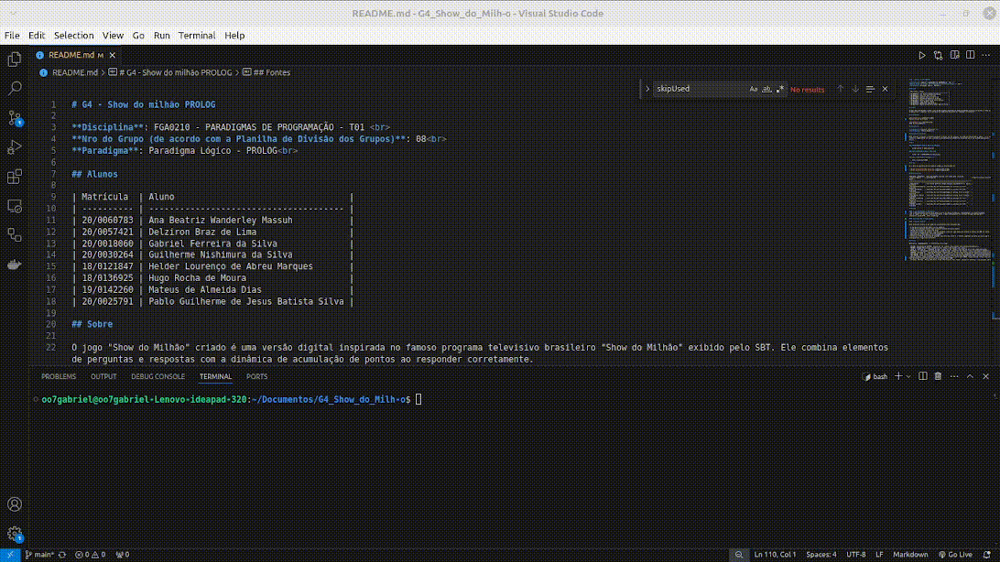

# G4 - Show do milhão PROLOG

**Disciplina**: FGA0210 - PARADIGMAS DE PROGRAMAÇÃO - T01  
**Nro do Grupo (de acordo com a Planilha de Divisão dos Grupos)**: 08 
**Paradigma**: Paradigma Lógico - PROLOG 

## Alunos

| Matrícula  | Aluno                                  |
| ---------- | -------------------------------------- |
| 20/0060783 | Ana Beatriz Wanderley Massuh           |
| 20/0057421 | Delziron Braz de Lima                  |
| 20/0018060 | Gabriel Ferreira da Silva              |
| 20/0030264 | Guilherme Nishimura da Silva           |
| 18/0121847 | Helder Lourenço de Abreu Marques       |
| 18/0136925 | Hugo Rocha de Moura                    |
| 19/0142260 | Mateus de Almeida Dias                 |
| 20/0025791 | Pablo Guilherme de Jesus Batista Silva |

## Sobre 

O jogo "Show do Milhão" criado é uma versão digital inspirada no famoso programa televisivo brasileiro "Show do Milhão" exibido pelo SBT. Ele combina elementos de perguntas e respostas com a dinâmica de acumulação de pontos ao responder corretamente.

## Screenshots

Página Inicial do Projeto

Game em funcionamento.

GIF do Jogo em Uso

## Instalação 

**Linguagens**: Prolog e Javascript  
**Tecnologias**: Html e Docker 

## Instalação do Docker

Para executar o projeto é necessário possui o docker em sua máquina, tal pode ser encontrado a seguir: [Link de Instalação](https://docs.docker.com/engine/install/). Após entrar no link, procurar a sua perspectiva instalação de acordo com o seu sistema operacional, após essa instalação basta seguir as instruções de uso.

## Uso 

### PRIMEIRAMENTE FAÇA O BUILD DO PROJETO:

    docker build -t show_do_milhao .

### APÓS EXECUTADO O BUILD, RODE COM:

    docker run -p 8080:8080 show_do_milhao

### ABRA O NAVEGADOR E NAVEGUE ATÉ:

    http://localhost:8080

## Vídeo

Os vídeos de apresentação do trabalho podem ser encontrados em:

- [Video de Apresnetação Parte 1](./videos/video_1.mkv)
- [Video de Apresnetação Parte 2](./videos/video_2.mkv)

## Participações

Apresente, brevemente, como cada membro do grupo contribuiu para o projeto.
| Nome do Membro      | Contribuição                                                 | Significância da Contribuição para o Projeto (Excelente/Boa/Regular/Ruim/Nula) |
| ------------------- | ------------------------------------------------------------ | ------------------------------------------------------------------------------ |
| Hugo Rocha          | Criação de parte do código prolog e implementação do  docker | Excelente                                                                      |
| Guilherme Nishimura | Contribuição com funcionalidades no prolog e no front        | Excelente                                                                      |
| Pablo Guilherme     | Contribuição com funcionalidades no prolog e no front        | Excelente                                                                      |
| Delziron Braz       | Contribuição com funcionalidades no prolog, front e docker   | Excelente                                                                      |
| Ana Beatriz Massuh  | Contribuição com funcionalidades no prolog, front e docker   | Excelente                                                                      |
| Mateus de Almeida   | Contribuição com funcionalidades no prolog e no front        | Excelente                                                                      |
| Gabriel Ferreira    | Contribuição com funcionalidades no prolog e no front        | Excelente                                                                      |
| Helder Lourenço     | Contribuição com funcionalidades no prolog e no front        | Excelente                                                                      |

## Outros

#### Lições Aprendidas e Percepções
- As lições aprendidas incluíram a modularização do código em Prolog, compreendendo suas peculiaridades, 
como as regras e o uso de cláusulas dinâmicas. O mais interessante foi utilizar Prolog como uma API e 
consumi-la usando HTML, CSS e JavaScript.

#### Contribuições e Fragilidades

#### Trabalhos Futuros

Para trabalhos futuros o que pode ser incrementado e/ou corrigido são:

- A adição de previsão de quanto vale a pergunta.
- A adição de efeitos sonoros como o Errou e Acertou do Silvio Santos.
- Adição de contador de números de dicas.
- Aletorizar valores de premios, como por exemplo, modos de jogo especiais valendo 2 milhoẽs ou 500 mil reais.
- Adicionar um temporizador para cada pergunta.
- Refatorar dicas para possuir um limitador.

## Fontes

Referencie, adequadamente, as referências utilizadas.

- DOCKER. *Documentação DOCKER*. Disponível em: <https://docs.docker.com/reference/dockerfile/>
- DOCKER. *Imagem SWI prolog*. Disponível em: <https://hub.docker.com/_/swipl/>
- LAGO, S. *Introdução à linguagem Prolog*. Disponível em: <https://www.ime.usp.br/~slago/slago-prolog.pdf>
- MEIDANIS, J. *Paradigmas de programação usando Prolog*. Disponível em: <https://www.ic.unicamp.br/~meidanis/courses/mc346/2017s2/prolog/apostila-prolog.pdf>
- AUGUSTO. *Introdução à programação Prolog*. Disponível em: <https://dcm.ffclrp.usp.br/~augusto/teaching/ia/IA-Prolog-Introducao-Tutorial.pdf>
- SWI-PROLOG. *Http server Prolog*. Disponível em: <https://www.swi-prolog.org/pldoc/doc_for?object=thread_httpd%3Ahttp_server/2>
- SWI-PROLOG. *Json com Prolog*. Disponível em: <https://www.swi-prolog.org/pldoc/doc/_SWI_/library/ext/http/http/json.pl>
- Gazeta do Povo. *Show do milhão: sucesso de audiência no início do anos 2000*. Disponível em: https://www.semprefamilia.com.br/blogs/milnovecentosebolinha/show-do-milhao-sucesso-de-audiencia-no-inicio-dos-anos-2000/
- Strachan, Matthew. *Música:Who Wants To Be A Millionaire Full Theme*. Disponível em:https://www.youtube.com/watch?v=l6y20VCCal4.
